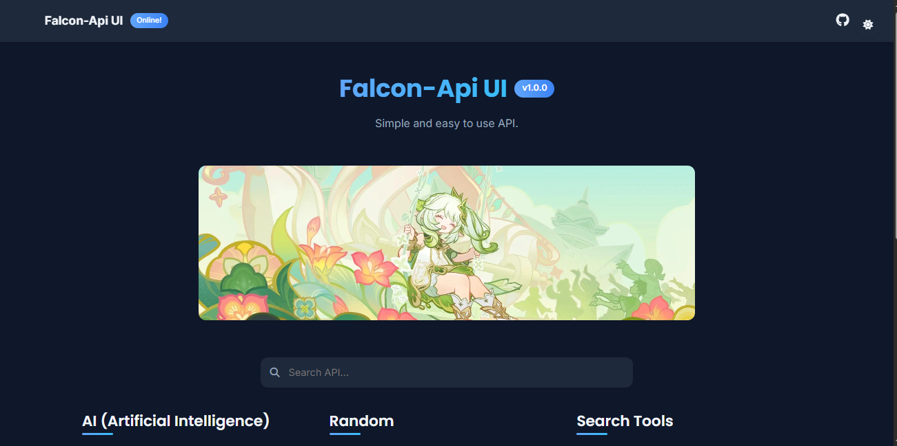

# Falcon API UI

A modern, clean, and user-friendly interface for browsing and testing Falcon API endpoints.



## Features

- 🌓 **Light/Dark Mode**: Toggle between light and dark themes with automatic preference saving
- 🔍 **Smart Search**: Quickly find endpoints by name or description
- 📱 **Responsive Design**: Works perfectly on desktop, tablet, and mobile devices
- 🔄 **API Status Indicators**: Visual indicators showing the status of each endpoint (ready, error, update)
- 📋 **Copy to Clipboard**: One-click copying of API endpoints and responses
- 📊 **JSON Highlighting**: Beautifully formatted JSON responses with syntax highlighting
- 📝 **Detailed Parameter Forms**: Clearly labeled input fields with tooltips for parameter descriptions

## Getting Started

### Prerequisites

- Web server (Apache, Nginx, etc.)
- Modern web browser

### Installation

1. Clone this repository to your web server:
   ```bash
   git clone https://github.com/FlowFalcon/falcon-api-ui.git
   ```

2. Configure your API endpoints in `settings.json` (see Configuration section below)

3. Access the UI through your web server (e.g., `https://your-domain.com/falcon-api-ui/`)

## Configuration

All API endpoints and categories are configured in the `settings.json` file. The structure is as follows:

```json
{
  "name": "Falcon-Api",
  "version": "v1.2",
  "description": "Simple and easy to use API.",
  "bannerImage": "/src/banner.jpg",
  "header": {
    "status": "Online!"
  },
  "apiSettings": {
    "creator": "FlowFalcon", 
    "apikey": ["falcon-api"]
  },
  "categories": [
    {
      "name": "Category Name",
      "image": "/api/placeholder/800/200",
      "items": [
        {
          "name": "Endpoint Name",
          "desc": "Endpoint description",
          "path": "/api/endpoint?param=",
          "status": "ready", // Can be "ready", "error", or "update"
          "params": {
            "param": "Description of the parameter"
          }
        }
      ]
    }
  ]
}
```

### Adding a New Endpoint

To add a new endpoint:

1. Find the appropriate category in the `categories` array or create a new one
2. Add a new object to the `items` array with the following properties:
   - `name`: Display name of the endpoint
   - `desc`: Brief description of what the endpoint does
   - `path`: The API path, including any query parameters
   - `status`: Status of the endpoint (`"ready"`, `"error"`, or `"update"`)
   - `params`: Object containing parameter names as keys and descriptions as values

Example:
```json
{
  "name": "User Info",
  "desc": "Get user information by ID",
  "path": "/api/user?id=",
  "status": "ready",
  "params": {
    "id": "User ID number"
  }
}
```

## Customization

### Theme Colors

You can customize the colors by modifying the CSS variables in the `styles.css` file:

```css
:root {
  --primary-color: #4361ee;
  --secondary-color: #3a86ff;
  --accent-color: #4cc9f0;
  /* Additional color variables... */
}
```

### Banner Image

Change the banner image by updating the `bannerImage` property in `settings.json`:

```json
{
  "bannerImage": "/path/to/your/banner.jpg"
}
```

## Browser Support

- Chrome (latest)
- Firefox (latest)
- Safari (latest)
- Edge (latest)

## Contributing

Contributions are welcome! Please feel free to submit a Pull Request.

## License

This project is licensed under the MIT License - see the LICENSE file for details.

## Acknowledgements

- [Font Awesome](https://fontawesome.com/) for icons
- [Bootstrap](https://getbootstrap.com/) for layout components
- [Inter Font](https://fonts.google.com/specimen/Inter) for typography

---

Created with ❤️ by [FlowFalcon](https://github.com/FlowFalcon)
